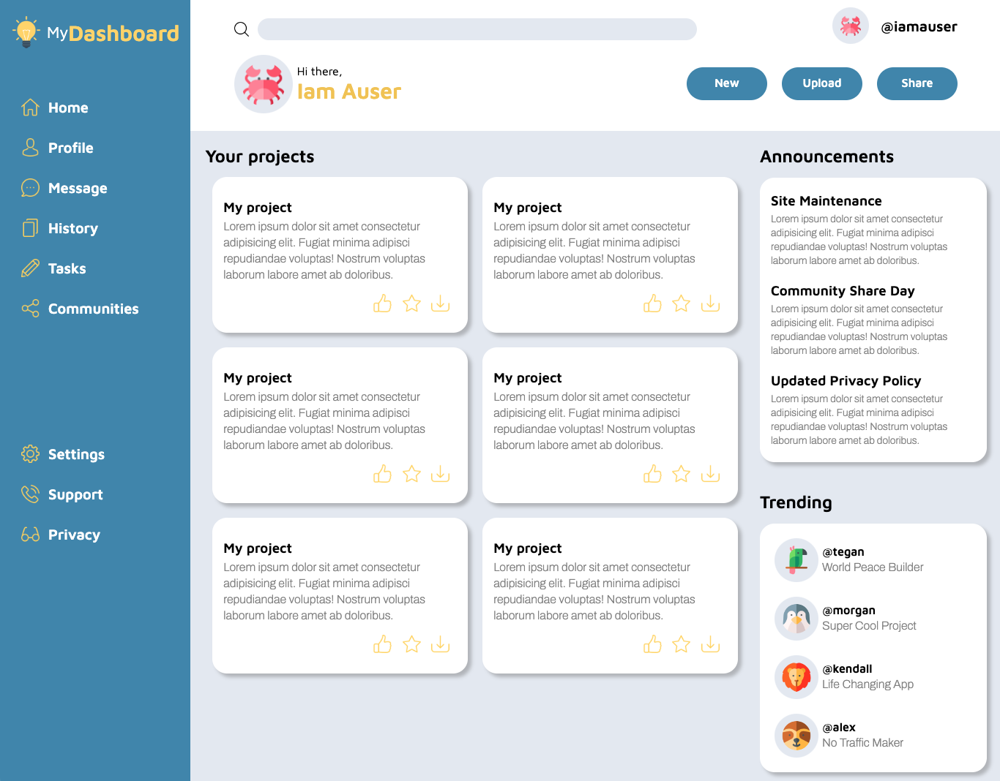

# Project: Admin Dashboard ([Live Demo](https://martazare.github.io/Dashboard/))

_**Upcoming updates:**_ This week I learned more about responsive design, so next week this page will be responsive!

In this project I practised using CSS Grid.

For main page layout I used CSS Grid and for small layout alterations I used Flexbox.

[Animal](https://www.flaticon.com/packs/animals-126) pictures and [icons](https://www.flaticon.com/packs/multimedia-collection) created by flaticon.
